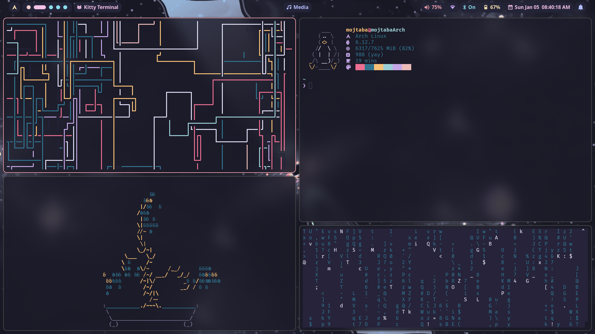
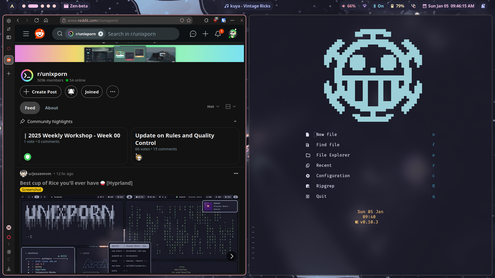
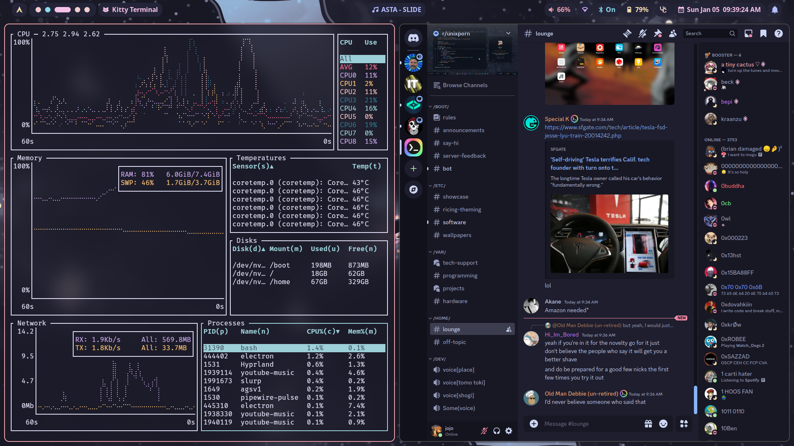
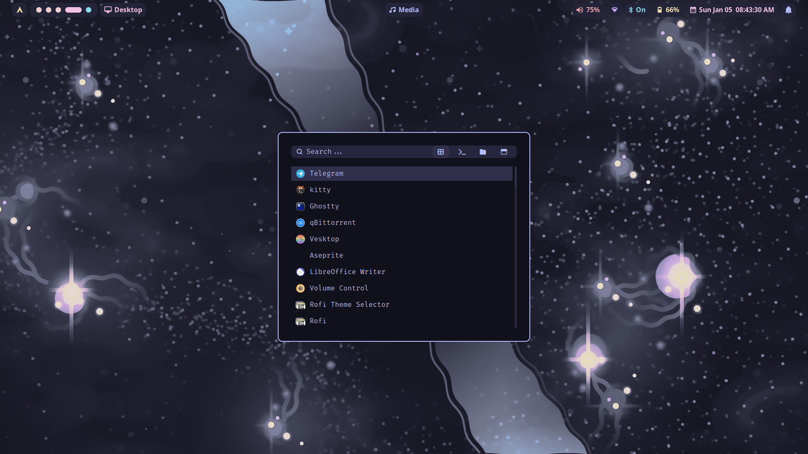
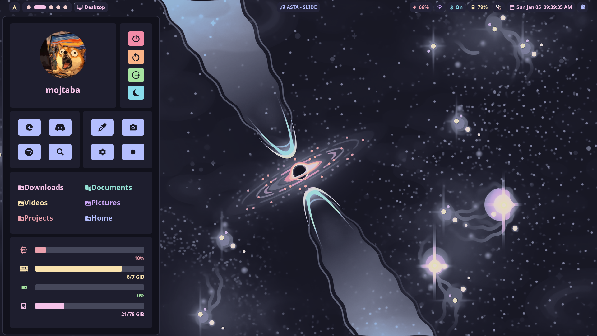

# dotfiles

## showcase 
---

---

## What i use
---
-  WM : hyprland 
- Terminal : kitty
- Editor : neovim 
- Bar : hyprpanel 
- Browser : zen 
- Launcher : rofi
- File manager : thunar 
- Gtk-theme : catppuccin-mocha

